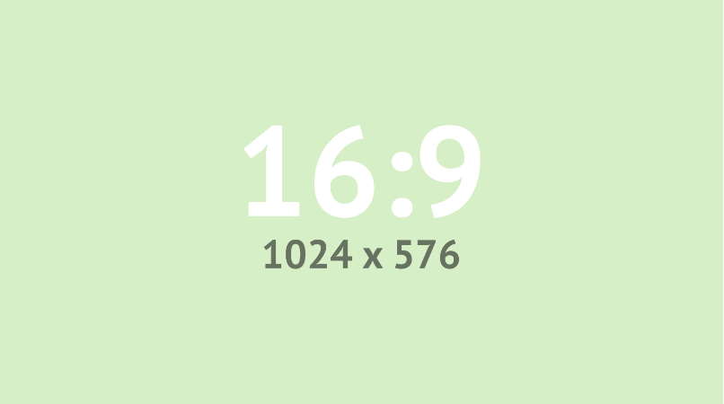

# Projects  

### [NLP budget speeches](https://agevst.github.io/storyboard/speech/speech.html)          

******

# Storyboard template  

## Storyboard template    

### Storyboard template    

#### Storyboard template    

Check the live page [here](https://agevst.github.io/storyboard/storyboard.html)    

A polygon is simply a data.frame with an **x and y column**, where each row demarcates an anchor point for the <a href="https://github.com/agevst">polygon</a>. The polygon is _not in closed form_, that is, the first point is not repeated in the end. If more polygons are wanted you can provide an additional column that indicate the polygon membership of a column (quite like `ggplot2::geom_polygon()` expects an x, y, and group variable).   

> If holed polygons are needed, holes should follow the main polygon and be separated with an NA row in the x and y column.          

<!-- image -->

	

	<h2 style="color:#FF7E7E">Digital footprint</h2>
	

		 
		 
	

Maintained by <a href="https://github.com/darwinanddavis">Matt Malishev</a>     

