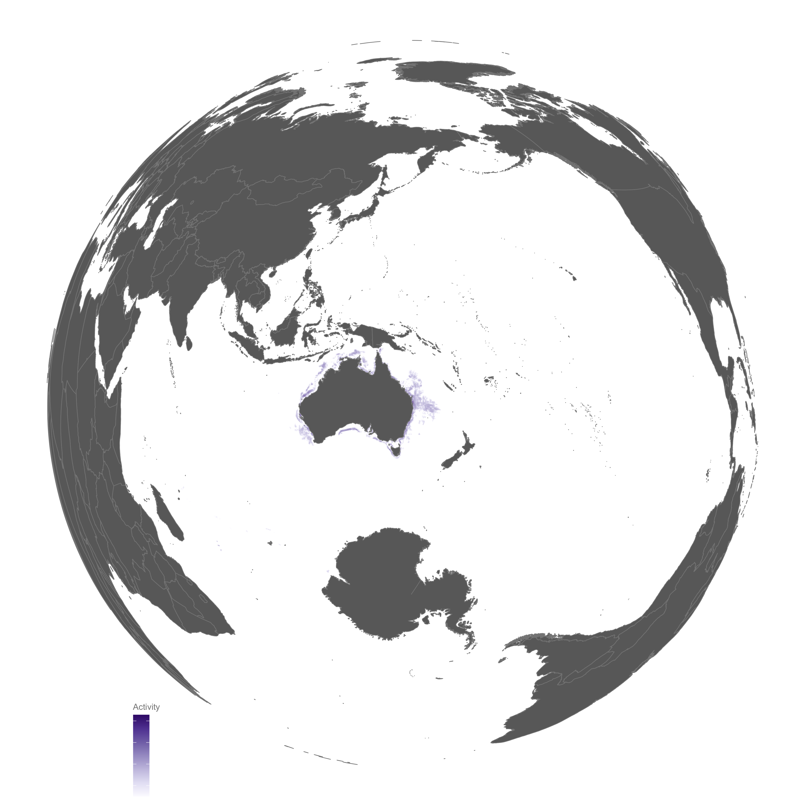

---
params:
  title: "Who's eating Australia's fish?"  
  author: "Visual Stories Team"
  social: "The Age"
  date: "1 June 2023"    
  primary: "#729E70"
  secondary: "#c3c3c3"
  header1: "Global EEZ and fishing regions"
  header2: "Country level fishprint"
  header3: "The decline of commercial fish"  
  header4: "Fish fight: Australia EEZ and competing nations"
  header5: "Case study of individual vessels"  
  header6: "Impact of fishing monopoly on stock availability (fish migration)"
  here: "fishing"
  imgdir: "img"
  img1: "fish1.jpeg"
  github: "https://github.com/agevst"      
output: 
  # pdf_document:
  html_document:
    theme: "cosmo"
    css: ~/projects/storyboard/css/style.css
    includes:
      before_body: html/header.html
      after_body: html/footer.html
editor_options: 
  markdown: 
    wrap: 72
---

<!-- quicksand font -->

<!-- <link rel="stylesheet"href="//fonts.googleapis.com/css?family=Quicksand:300,400,600,700&amp;lang=en"/> -->

<!-- css for tabs -->

```{=html}
<style type="text/css">

.nav>li>a{
    position: relative;
    display: block;
    padding: 10px 15px;
}

.nav-pills>li>a:hover{
  background: `r params$primary`;
  color: `r params$secondary`;
  opacity:0.7;
}

.nav-pills>li>a:focus, .nav-pills>li.active>a, .nav-pills>li.active>a:hover, .nav-pills>li.active>a:focus {
  background: `r params$primary`;
  background-color: `r params$primary`;
}

</style>
```
```{r, set-options, echo = F, cache = T, message=F, warning=F}
options(width=25,tinytex.verbose = TRUE, width.cutoff=25)
knitr::opts_chunk$set(
 eval = F, # run all code
 echo = F, # show code chunks in output 
 tidy = T, # make output as tidy
 message = F,  # mask all messages
 warning = F, # mask all warnings 
 size="small", # set code chunk size,
 tidy.opts=list(width.cutoff=25) # set width of code chunks in output
)
# tinytex::install_tinytex()
# require(tinytex)
# install.packages("pacman")
# require(pacman)

pacman::p_load(dplyr)
# knitr::read_chunk(here::here("r","make_map.R"))
# source(here::here("r","make_gitignore.R"))
# source(here::here("r","make_plot_stacked.R"))
```


\  

# [`r params$title`]{style="font-size: 200%;"}

\  
\  

<center>[`r params$author` \| `r params$social`
<br>`r params$date`]{style="font-size: 120%; color:`r params$secondary`;"}</center>

------------------------------------------------------------------------

# Storyboard    


<!-- here is aus eez where fishing from other nations is illegal (world globe)   -->
<!-- here is the route of fishing vessels X from Japan fishing for tuna, one of the most active nations near Aus   waters. individual vessels fish for many species, such as Z (world globe)   -->
<!-- here are all of Japan's fishing vessels for one year (world globe)   -->
<!-- here are all countries that fished near Aus for 2020 (aus spotlight)        -->

\  


```{r, echo = F, cache = T, fig.width=12, fig.height=12, warning=FALSE, message=FALSE}
pacman::p_load(here,dplyr,ggplot2,readr,ggthemes,colorspace,sf,rnaturalearth,lubridate,svglite,rgdal,stringr,gganimate,scales,concaveman,patchwork,grid,forcats,rmapshaper,threejs,magick) %>% suppressMessages()

yr <- 2020

# eez
eez <-  here::here(params$here,"data","world_eez_simplified",paste0("eez_world_",0.005,".shp")) %>% st_read(quiet = T)
aus_eez_lat <- eez %>% filter(SOVEREIGN1 == "Australia") %>% st_coordinates() %>% .[,"Y"]
aus_eez_lon <- eez %>% filter(SOVEREIGN1 == "Australia") %>% st_coordinates() %>% .[,"X"]

earth <- here::here(params$here,"img","globe#6086AD1convert_colorise.png")

# globe vessel data
lupeng_all <- readRDS(here::here(params$here,"data","globe_lupeng_all.Rda"))

# plot --------------------------------------------------------------------

bg <- "#6086AD"  #"#6086AD" # 
coll <- "#000000"
colh <- "#CE7024"
opac <- 1


# function for loading data and plotting globe 
plot_globe <- function(mm,colors,cex,fov,rlon,rlat){
  x <- activity %>%
    filter(mmsi %in% mm) %>% #  target_mmsi tv_top
    distinct(cell_ll_lat, cell_ll_lon, .keep_all = T) %>% # get distinct latlon to simplify data
    rename("lat" = 2, "lon" = 3)
  val <- x$fishing_hours
  fov <-fov
  rlon <- rlon
  rlat <- rlat
  # globe
  globejs(
    img = earth,
    lat = x$lat, long = x$lon, val = 1,color = colors, pointsize = cex, atmosphere = T, bg = "#FFFFFF", fov = fov, rotationlong = rlon,rotationlat = rlat # ,height = height,width = height
  )
}


```


# Module 1  

- globe of all EEZs  
- globe of Aus EEZs  
- globe of Aus fishing impact  
- globe of one of top 3 country fishing impact    

### All EEZ    


\  


### Aus EEZ    


\  


### Aus global fishing  

   

\  

### Top nation global fishing e.g. China  


\  


----------------------------------------------------------------

## Module 2

- case study from one of top 3 countries above. Can be multiple case studies (globe)   

### Case study  (animated full globe)   
* follow vessel from one of top fishing nations above   

\  
```{r, echo = F, fig.width=12, fig.height=12, warning=FALSE, message=FALSE}
# module 3 ----------------------------------------------------------------

require(threejs)
require(sf)
require(colorspace)
require(scales)
require(dplyr)
require(readr)

earth <- here::here(params$here,"img","globe#6086AD1convert_colorise.png")

fov = 30
rlon = 84.5
rlat = 0.2
cn <- lupeng_all %>% nrow
colors <- c(
  rep("#33B679", aus_eez_lat %>% length),
  rep("gold" %>% darken(0.1),cn)
)
lat <- c(aus_eez_lat,lupeng_all %>% st_coordinates() %>% .[,"Y"])
lon <- c(aus_eez_lon,lupeng_all %>% st_coordinates() %>% .[,"X"])
globejs(
  img = earth,
  lat = lat,
  long = lon, val = 1,color = colors, pointsize = 0.3, atmosphere = T, bg = "#FFFFFF",fov = fov, rotationlong = rlon,rotationlat = rlat # ,height = height,width = height
)

```

\  

----------------------------------------------------------------

## Module 3   

\  


- Top 3 countries fishing around Aus (either 2020 data or all data) EEZ (spotlight)      
- all countries fishing around Aus EEZ (either 2020 data or all data) (spotlight)     
- all countries fishing within Aus EEZ (either 2020 data or all data) (spotlight)       

\  

Fleet size 2020  


### Top 3 countries fishing around Aus    
    


\  

### All countries fishing around Aus (either 2020 data or all data)   
* highlight how above case study is one of 1000s of vessels from many competing countries  
* zoom into AUS EEZ after following case study    

\         

   


\  


### All nations within Aus EEZ
- This may be shifted above after the case study      


\  

\  

------------------------------------------------------------------------

#### Credits

**DEVELOPER/3D VISUALISATION** Richard Lama, Nathanael Scott, Daniel
Carter **PHOTOS** Francis Kokoroko **DATA** Matt Malishev **DESIGN**
Mark Stehle, Luis Araujo, Kathleen Adele **VIDEO** Francis Kokoroko
**PRODUCTION** Matthew Absalom-Wong **EDITORS** Nick Ralston, Lia Timson


<!-- ### Exclusive Economic Zones (EEZ)   -->

<!--  -->


<!-- ------------------------------------------------------------------------ -->

<!-- # `r params$header2`  -->


<!-- ### Australia -->

<!--  -->

<!-- ### Other major nations e.g. China   -->

<!--  -->


<!-- ------------------------------------------------------------------------ -->

<!-- # `r params$header3` -->


<!-- Lorem ipsum dolor sit amet, consectetur adipiscing elit, sed do eiusmod -->
<!-- tempor incididunt ut labore et dolore magna aliqua. Risus at ultrices mi -->
<!-- tempus imperdiet. Dignissim diam quis enim lobortis scelerisque -->
<!-- fermentum dui faucibus. Tempor nec feugiat nisl pretium fusce id velit. -->
<!-- Ut lectus arcu bibendum at varius vel pharetra vel. Rhoncus urna neque -->
<!-- viverra justo nec ultrices dui sapien eget. Vestibulum sed arcu non odio -->
<!-- euismod lacinia at quis risus. -->


<!-- ------------------------------------------------------------------------ -->

<!-- # `r params$header4` -->


<!-- Lorem ipsum dolor sit amet, consectetur adipiscing elit, sed do eiusmod -->
<!-- tempor incididunt ut labore et dolore magna aliqua. Risus at ultrices mi -->
<!-- tempus imperdiet. Dignissim diam quis enim lobortis scelerisque -->
<!-- fermentum dui faucibus. Tempor nec feugiat nisl pretium fusce id velit. -->
<!-- Ut lectus arcu bibendum at varius vel pharetra vel. Rhoncus urna neque -->
<!-- viverra justo nec ultrices dui sapien eget. Vestibulum sed arcu non odio -->
<!-- euismod lacinia at quis risus. -->

<!-- Fishing hours per country over time   -->

<!--  -->

<!--   -->

<!-- \   -->


<!-- \   -->

<!-- ------------------------------------------------------------------------ -->

<!-- # `r params$header5` {.tabset .tabset-fade .tabset-pills} -->

<!-- Lorem ipsum dolor sit amet, consectetur adipiscing elit, sed do eiusmod -->
<!-- tempor incididunt ut labore et dolore magna aliqua. Risus at ultrices mi -->
<!-- tempus imperdiet. Dignissim diam quis enim lobortis scelerisque -->
<!-- fermentum dui faucibus. Tempor nec feugiat nisl pretium fusce id velit. -->
<!-- Ut lectus arcu bibendum at varius vel pharetra vel. Rhoncus urna neque -->
<!-- viverra justo nec ultrices dui sapien eget. Vestibulum sed arcu non odio -->
<!-- euismod lacinia at quis risus. -->

<!--  -->


<!-- Aus focus -->

<!--  -->


<!-- # `r params$header6` -->

<!-- Lorem ipsum dolor sit amet, consectetur adipiscing elit, sed do eiusmod -->
<!-- tempor incididunt ut labore et dolore magna aliqua. Risus at ultrices mi -->
<!-- tempus imperdiet. Dignissim diam quis enim lobortis scelerisque -->
<!-- fermentum dui faucibus. Tempor nec feugiat nisl pretium fusce id velit. -->
<!-- Ut lectus arcu bibendum at varius vel pharetra vel. Rhoncus urna neque -->
<!-- viverra justo nec ultrices dui sapien eget. Vestibulum sed arcu non odio -->
<!-- euismod lacinia at quis risus. -->

<!-- Nunc mi ipsum faucibus vitae aliquet nec ullamcorper. Tempus urna et -->
<!-- pharetra pharetra. Diam quam nulla porttitor massa id neque aliquam -->
<!-- vestibulum morbi. Blandit cursus risus at ultrices mi tempus imperdiet. -->
<!-- Mauris ultrices eros in cursus turpis massa tincidunt dui. Cras -->
<!-- fermentum odio eu feugiat. Vitae tortor condimentum lacinia quis vel -->
<!-- eros donec. Scelerisque mauris pellentesque pulvinar pellentesque -->
<!-- habitant morbi tristique senectus. Tempor nec feugiat nisl pretium. -->
<!-- Vitae tempus quam pellentesque nec nam aliquam. -->


<!-- \   -->

<!-- \   -->

<!-- ------------------------------------------------------------------------ -->


<!-- ------------------------------------------------------------------------ -->

<!-- ------------------------------------------------------------------------ -->

<!-- ------------------------------------------------------------------------ -->

<!-- LAB -->

<!-- Embed iframes -->

<!-- https://stackoverflow.com/questions/54637384/embed-a-html-found-on-web-in-rmarkdown -->

<!-- <iframe width='1000px' height='1000px' src='https://www.smh.com.au/interactive/modules/big-timeline/index.html?resizable=true&date=&time=June%2026&headline=Greater%20Sydney%20enters%20lockdown&image=&credit=&v=15' > -->

<!--   <p>Your browser does not support iframes</p> -->

<!-- </iframe>   -->
