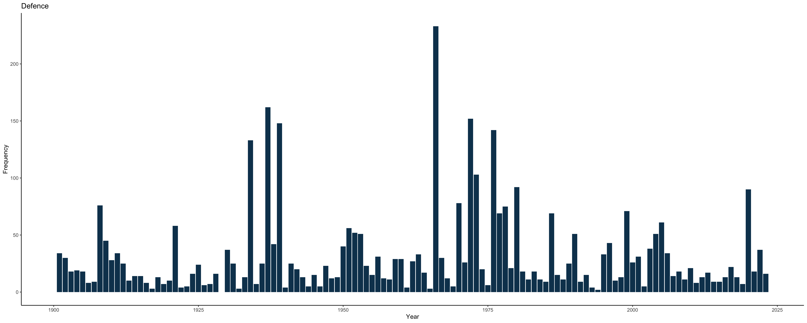
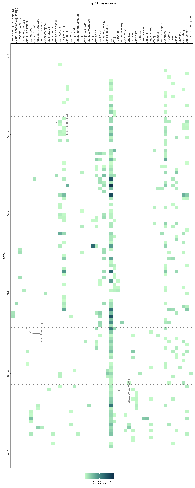

---
params:
  title: "How AI can reveal political language evolution, patterns, and biases from 123 years of federal budget speeches in Australia"  
  author: "Visual Stories Team"
  social: "The Age"
  date: "1 June 2023"    
  primary: "#729E70"
  secondary: "#c3c3c3"
  header1: "Toy case study"
  header2: "Topic selection"
  header3: "Timeline analysis"
  header4: "Sentiment analysis of language"  
  header5: "Lessons from Natural Language Processing"
  here: "r"
  imgdir: "img"
  img1: "toy.jpeg"
  github: "https://github.com/vst"      
output: 
  # pdf_document:
  html_document:
    theme: "cosmo"
    css: ~/projects/storyboard/css/style.css
    includes:
      before_body: ~/projects/storyboard/html/header.html
      after_body: ~/projects/storyboard/html/footer.html
---

<!-- quicksand font -->

<!-- <link rel="stylesheet"href="//fonts.googleapis.com/css?family=Quicksand:300,400,600,700&amp;lang=en"/> -->

<!-- css for tabs -->

```{=html}
<style type="text/css">

.nav>li>a{
    position: relative;
    display: block;
    padding: 10px 15px;
}

.nav-pills>li>a:hover{
  background: `r params$primary`;
  color: `r params$secondary`;
  opacity:0.7;
}

.nav-pills>li>a:focus, .nav-pills>li.active>a, .nav-pills>li.active>a:hover, .nav-pills>li.active>a:focus {
  background: `r params$primary`;
  background-color: `r params$primary`;
}

</style>
```


```{r, set-options, echo = F, cache = T, message=F, warning=F}
options(width=25,tinytex.verbose = TRUE, width.cutoff=25)
knitr::opts_chunk$set(
 eval = F, # run all code
 echo = F, # show code chunks in output 
 tidy = T, # make output as tidy
 message = F,  # mask all messages
 warning = F, # mask all warnings 
 size="small", # set code chunk size,
 tidy.opts=list(width.cutoff=25) # set width of code chunks in output
)
# tinytex::install_tinytex()
# require(tinytex)
# install.packages("pacman")
# require(pacman)

pacman::p_load(dplyr)
# knitr::read_chunk(here::here("r","make_map.R"))
source(here::here("r","make_gitignore.R"))
# source(here::here("r","make_plot_stacked.R"))
```

\  
\  

# [`r params$title`]{style="font-size: 200%;"}

\  
\      

<center> 
[`r params$author` | `r params$social` <br>`r params$date`]{style="font-size: 120%; color:`r params$secondary`;"} 
</center>

------------------------------------------------------------------------

# Intro to NLP  

Lorem ipsum dolor sit amet, consectetur adipiscing elit, sed do eiusmod tempor incididunt ut labore et dolore magna aliqua. Risus at ultrices mi tempus imperdiet. Dignissim diam quis enim lobortis scelerisque fermentum dui faucibus. Tempor nec feugiat nisl pretium fusce id velit. Ut lectus arcu bibendum at varius vel pharetra vel. Rhoncus urna neque viverra justo nec ultrices dui sapien eget. Vestibulum sed arcu non odio euismod lacinia at quis risus.   

  
------------------------------------------------------------------------  

# `r params$header1`

Toy case study of how Natural Language Processing (NLP) analyses text.  

Showcase of how modern computing and machine learning can now easily analyse millions of words and historical patterns ie. use a simple case study of language processing to introduce NLPs then dive into budget speech analysis     

\   

<!-- ##### Centered image -->

<!-- ```{=html} -->
<!-- <div align="center"; text-align:center> -->
<!--    -->
<!-- </div> -->
<!-- ``` -->

\     

#### How NLP text analysis works      

<!-- row 1 -->
<div class = "row">
  <div class = "col-md-8"> <!-- img  -->
  <center> 
  </center>
</div>
  
  <div class = "col-md-4"> 
  <br>

Step through of how NLP models analyse text using tokenising to parse individual words, verbage, language, and keywords, such as identifying 
[nouns]{style="color:black;background-color:#CD8574;opacity:1;"}, 
[pronouns]{style="color:black;background-color:#C6E4B1;opacity:1;"}, 
[verbs]{style="color:black;background-color:#EDD298;opacity:1;"}, and 
[keywords]{style="color:black;background-color:#83ABF4;opacity:1;"} (Universal Parts of Speech, UPOS).  

```{r, echo = F, message=F,warning=F}
require(ggplot2)  
require(dplyr)

df <- data.frame(
  "label" = c("Keywords","Pronouns","Nouns","Verbs"),
  "freq" = c(12,7,5,6),
  "colpal" = c("#83ABF4","#C6E4B1","#CD8574","#EDD298")
)
limits <- df$label %>% unique

ggplot() + 
  geom_col(data =df, aes(label,freq,fill=colpal), col =NA, show.legend=F) + 
  scale_fill_manual(values = df$colpal %>% unique) +  
  scale_x_discrete(limits = limits) +
  labs(x = "Language", y = "Frequency") +
  coord_flip() +
  theme_classic() +
  theme(text = element_text(size = 25))

```

\  
\  

* Token/tokenising = individual words  
* UPOS = Universal Parts of Speech (word classification)  
* Lemma/lemmatising = root word form of each token    
* Tagging  
* Dependency Parsing Annotation  


  </div>
</div>

\    


------------------------------------------------------------------------

# `r params$header2` {.tabset .tabset-fade .tabset-pills}

Select three global and political topics that most interest you      

* Data dive into topics reader chooses (below outputs)  

## Defence  
## Climate   
## Housing
## Immigration 
## Environment
## Jobs (unemployment)
## Tax (breaks or increases)
## Pension
## Aged care
## Transport 
## Education
## Trade 
## Budget - Debt / surplus
## Technology 
## Manufacturing
## Health
## Hospitals
## Crime
## Espionage  

#

------------------------------------------------------------------------

# `r params$header3`

Timeline analysis of the last 123 years of budget speeches using chosen topics  

* Highlight key global events in timeline to show how different parties and Aus politics in general responded to global events eg Greta Thunberg's birth      
* how language shifts over time and between parties  
* how parties favour keywords or language surrounding key topics  
* which parties react to global events/issues   


  

\  
\  

  


\   
\  


------------------------------------------------------------------------

# `r params$header4` {.tabset .tabset-fade .tabset-pills}

Sentiment analysis of tone 

* Analysis of positive vs negative discourse - how language changes over time, which parties are more -/+ on issues, show how certain topics are systematically linked to negative language eg. illegal immigration, unskilled immigrants, etc.  


<!-- tab1 -->

<!-- ## [Plots]{style="color:`r params$secondary`;"} # add custom css styling to tabs-->

## Defence  

    

    


## Tax
  
        




# 

\  

Deep dive example      


# `r params$header5`

Lorem ipsum dolor sit amet, consectetur adipiscing elit, sed do eiusmod tempor incididunt ut labore et dolore magna aliqua. Risus at ultrices mi tempus imperdiet. Dignissim diam quis enim lobortis scelerisque fermentum dui faucibus. Tempor nec feugiat nisl pretium fusce id velit. Ut lectus arcu bibendum at varius vel pharetra vel. Rhoncus urna neque viverra justo nec ultrices dui sapien eget. Vestibulum sed arcu non odio euismod lacinia at quis risus.   

Nunc mi ipsum faucibus vitae aliquet nec ullamcorper. Tempus urna et pharetra pharetra. Diam quam nulla porttitor massa id neque aliquam vestibulum morbi. Blandit cursus risus at ultrices mi tempus imperdiet. Mauris ultrices eros in cursus turpis massa tincidunt dui. Cras fermentum odio eu feugiat. Vitae tortor condimentum lacinia quis vel eros donec. Scelerisque mauris pellentesque pulvinar pellentesque habitant morbi tristique senectus. Tempor nec feugiat nisl pretium. Vitae tempus quam pellentesque nec nam aliquam.


\  
\    

------------------------------------------------------------------------    

#### Credits

**DEVELOPER/3D VISUALISATION** Richard Lama, Nathanael Scott, Daniel Carter **PHOTOS** Francis Kokoroko **DATA** Matt Malishev **DESIGN** Mark Stehle, Luis Araujo, Kathleen Adele **VIDEO** Francis Kokoroko **PRODUCTION** Matthew Absalom-Wong **EDITORS** Nick Ralston, Lia Timson


<!-- ------------------------------------------------------------------------ -->
<!-- ------------------------------------------------------------------------ -->
<!-- ------------------------------------------------------------------------ -->

<!-- LAB -->

<!-- Embed iframes -->

<!-- https://stackoverflow.com/questions/54637384/embed-a-html-found-on-web-in-rmarkdown -->
<!-- <iframe width='1000px' height='1000px' src='https://www.smh.com.au/interactive/modules/big-timeline/index.html?resizable=true&date=&time=June%2026&headline=Greater%20Sydney%20enters%20lockdown&image=&credit=&v=15' > -->
<!--   <p>Your browser does not support iframes</p> -->
<!-- </iframe>   -->