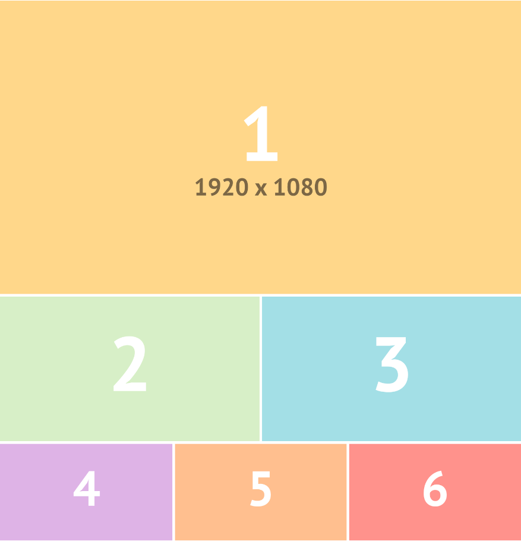
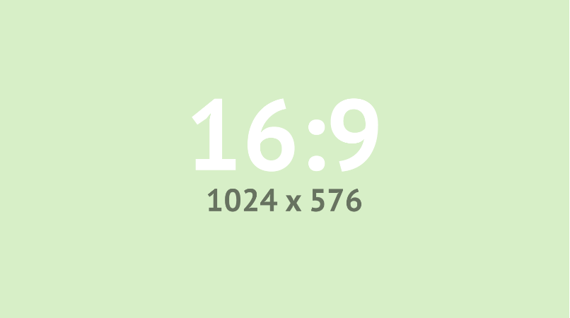

---
params:
  title: "Visual Stories Team: Creating and designing dope stuff"  
  author: "Visual Stories Team"
  social: "The Age"
  date: "1 March 2023"    
  primary: "#729E70"
  secondary: "#c3c3c3"
  header1: "Images"
  header2: "Maps"
  header3: "Plots"
  header4: "Tabbed pages"
  here: "r"
  imgdir: "img"
  img1: "img_16x9.png"
  img2: "img_social.png"
  github: "https://github.com/vst"      
output: 
  # pdf_document:
  html_document:
    theme: "cosmo"
    css: css/style.css
    includes:
      before_body: header.html
      after_body: footer.html
---

<!-- quicksand font -->

<!-- <link rel="stylesheet"href="//fonts.googleapis.com/css?family=Quicksand:300,400,600,700&amp;lang=en"/> -->


https://github.com/agevst/storyboard.git

echo "# storyboard" >> README.md
git init
git add README.md
git commit -m "first commit"
git branch -M main
git remote add origin https://github.com/agevst/storyboard.git
git push -u origin main

<!-- css for tabs -->

```{=html}
<style type="text/css">

.nav>li>a{
    position: relative;
    display: block;
    padding: 10px 15px;
}

.nav-pills>li>a:hover{
  background: `r params$primary`;
  color: `r params$secondary`;
  opacity:0.7;
}

.nav-pills>li>a:focus, .nav-pills>li.active>a, .nav-pills>li.active>a:hover, .nav-pills>li.active>a:focus {
  background: `r params$primary`;
  background-color: `r params$primary`;
}

</style>
```


```{r, set-options, echo = F, cache = T, message=F}
options(width=25,tinytex.verbose = TRUE, width.cutoff=25)
knitr::opts_chunk$set(
 eval = F, # run all code
 echo = F, # show code chunks in output 
 tidy = T, # make output as tidy
 message = F,  # mask all messages
 warning = F, # mask all warnings 
 size="small", # set code chunk size,
 tidy.opts=list(width.cutoff=25) # set width of code chunks in output
)
# tinytex::install_tinytex()
# require(tinytex)
# install.packages("pacman")
# require(pacman)

knitr::read_chunk(here::here("r","make_map.R"))
source(here::here("r","make_gitignore.R"))
source(here::here("r","make_plot_stacked.R"))
```

\  
\  

# [`r params$title`]{style="font-size: 200%;"}

\  
\      

<center> 
[`r params$author` | `r params$social` <br>`r params$date`]{style="font-size: 120%; color:`r params$secondary`;"} 
</center>

------------------------------------------------------------------------

# Intro

The tunnel runs 150 metres underground. Inside, Australian mining manager Andrew Head is trudging through mud and muck. He only has a headlight to guide him as the temperature in this dark pit in western Africa hits **45 degrees**.

> "It's like a scene from Raiders of the Lost Ark."

The tunnel has gold running through its veins. Head, a rugged 48-year-old, father-of-three from *Sydney's northern suburbs* is searching for gaps in the wall. Separated by 2½ kilometres of rock, rubble and poverty above ground, the mines stand opposite each other. One is an Australian exploration mine run by Cassius Mining Limited. The other is a Chinese state-linked mine run by the Shaanxi Mining Company.

------------------------------------------------------------------------

# `r params$header1`



<!-- side by side image placement -->

<!-- option 1 -->

```{r, echo=FALSE,out.width="50%",out.height="20%",fig.cap="CREDIT: Supplied",fig.show='hold',fig.align='center'}
#
# knitr::include_graphics(c(
#   "/Users/matt.malishev/projects/sleep/plot/deloitte/table4_4/Insomnia_000_.png",
#   "/Users/matt.malishev/projects/sleep/plot/deloitte/table4_4/OSA_000_.png")
#   )
```

<!-- option 3 -->\

\  

##### Side by side image

```{r, echo = FALSE, out.width = "33%", fig.align = "center", out.extra = "style = 'display: inline;'", fig.show='hold', fig.align='center'}
knitr::include_graphics(c(
  paste(params$imgdir,params$img1,sep = "/"),
  paste(params$imgdir,params$img2,sep = "/"),
  paste(params$imgdir,params$img1,sep = "/")
  ))
```


\   

##### Centered image

```{=html}
<div align="center"; text-align:center>
  
</div>
```

\     

##### Left aligned  

<!-- row 1 -->
<div class = "row">
  <div class = "col-md-8"> <!-- img  -->
  <center> 
  </center>
</div>
  
  <div class = "col-md-4"> 
  <br>

The tunnel runs 150 metres underground. Inside, Australian mining manager Andrew Head is trudging through mud and muck. He only has a headlight to guide him as the temperature in this dark pit in western Africa hits 45 degrees.  

<br>     

The tunnel has gold running through its veins. Head, a rugged 48-year-old, father-of-three from Sydney's northern suburbs is searching for gaps in the wall.

<br>     

  </div>
</div>

\    

##### Right aligned

<!-- row 2 -->
<div class = "row">
  <div class = "col-md-4 right-just"> <!-- img  -->
  
  <br><br>   

> The tunnel runs 150 metres underground. Inside, Australian mining manager Andrew Head is trudging through mud and muck. He only has a headlight to guide him as the temperature in this dark pit in western Africa hits 45 degrees.  

<br>     

</div>
  <div class = "col-md-8"> 
  <center> 
  </center>
  </div>
</div>

------------------------------------------------------------------------

# `r params$header2`

Visual Stories Team\
717 Bourke St, Docklands, Melbourne & 1 Denison St, North Sydney, Sydney\
(Click on markers for directions)\
\

```{r,code = readLines("r/make_map.R"),echo=F,message=F,warning=F,out.width="100%"}

```

###### CAPTION: Some interactive map. CREDIT: Supplied.  

------------------------------------------------------------------------

# `r params$header3`

```{r,echo=F,message=F,warning=F,out.width="100%"}
require(tidyr)
require(plotly)
require(colorspace)
sm <- as.data.frame(EuStockMarkets) %>% gather(index, price) %>% mutate(time = rep(EuStockMarkets %>% 
    time(), 4))
colpal <- sequential_hcl(sm$index %>% n_distinct, "Dark Mint")
sm %>% plot_ly(x = sm$time, y = sm$price, color = ~factor(sm$index), colors = colpal)
```

###### CAPTION: Some interactive line plot. CREDIT: Supplied.


\   
\  

##### Side by side plots

```{r,echo=F,eval = T, message=F,warning=F,out.width="100%"}
require(patchwork)
p1 + p2
```

###### CAPTION: Some side by side plots. CREDIT: Supplied.

##### Stacked plots

```{r,eval =T, echo=F,message=F,warning=F,out.width="100%"}
require(patchwork)
p1 / p2
```

###### CAPTION: Some stacked plots. CREDIT: Supplied.

------------------------------------------------------------------------

# `r params$header4` {.tabset .tabset-fade .tabset-pills}

<!-- tab1 -->

<!-- ## [Plots]{style="color:`r params$secondary`;"} # add custom css styling to tabs-->

## Plots

### Plots

```{r,code = readLines("r/make_plot.R"),echo=F,message=F,warning=F,out.width="100%"}

```

## Tables

### Tables

Table 1. Definitions of model parameters.

| Parameter | Definition             | Dimension<br/>(unit) |
|:---------:|:-----------------------|:--------------------:|
|    *L*    | structural length      |          cm          |
|   *ee*    | scaled reserve density |      J (cm^3^)       |
|    *D*    | host development       |         ---          |
|   *RH*    | reproduction buffer    |          J           |

<!-- tab2 -->

## Equations

### Equations

Accordingly, we write the eigenfunction of a spinless particle as the superposition of plane wave states of momentum ($\pi$) and energy ($Ej$) having amplitudes $a(\pi,Ej)$

$$  
\phi n(r,t) =  
\sum_{i, j} a(p_{i},E_{j})
e^{
\frac{i}
{h}
(p_{i} \cdot r - E_{j}t) 
}
$$

## Code

### Code chunks

Javascript to access `html` and `css`    
```{js, eval=F}
$('.title').css('color', 'red')
```

Python    
```{python, python.reticulate=F, eval=F}
x = 'hello, python world'
print(x.split(' '))
```


# 

\  
\    

------------------------------------------------------------------------    

#### Credits

**DEVELOPER/3D VISUALISATION** Richard Lama, Nathanael Scott, Daniel Carter **PHOTOS** Francis Kokoroko **DATA** Matt Malishev **DESIGN** Mark Stehle, Luis Araujo, Kathleen Adele **VIDEO** Francis Kokoroko **PRODUCTION** Matt Malishev, Matthew Absalom-Wong **EDITORS** Nick Ralston, Lia Timson


<!-- ------------------------------------------------------------------------ -->
<!-- ------------------------------------------------------------------------ -->
<!-- ------------------------------------------------------------------------ -->

<!-- LAB -->

<!-- Embed iframes -->

<!-- https://stackoverflow.com/questions/54637384/embed-a-html-found-on-web-in-rmarkdown -->
<!-- <iframe width='1000px' height='1000px' src='https://www.smh.com.au/interactive/modules/big-timeline/index.html?resizable=true&date=&time=June%2026&headline=Greater%20Sydney%20enters%20lockdown&image=&credit=&v=15' > -->
<!--   <p>Your browser does not support iframes</p> -->
<!-- </iframe>   -->